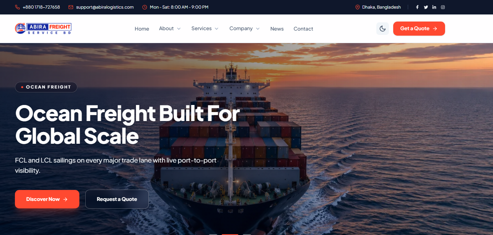

# ABIRA Logistics & Transport Service Bangladesh

ABIRA Logistics is a modern logistics and transportation company website built with Next.js to showcase freight forwarding, cargo movement, warehousing, customs support, and multimodal supply chain services. The platform presents a professional, reliable, and user-friendly experience for businesses seeking efficient logistics solutions across local and international trade routes.

## Overview

This project is designed to present ABIRA Logistics as a trusted logistics partner. It highlights the company’s service portfolio, operating strength, and customer-focused support through a modern responsive interface, structured service pages, and clear call-to-action sections for quote requests and support.

## Key Features

* **Logistics Services Showcase:** Air freight, ocean freight, road freight, rail freight, and hybrid freight offerings.
* **Customs & Compliance Support:** Brokerage services and trade documentation guidance for international shipping.
* **Warehousing Solutions:** Storage, inventory visibility, and secure logistics support.
* **Project Cargo Handling:** Heavy and oversized cargo transportation with specialized planning.
* **Modern Responsive Design:** Clean layout optimized for desktop, tablet, and mobile devices.
* **Service-Focused UX:** Dedicated pages for core logistics services and business inquiries.
* **Professional Branding:** Strong business presentation for a transport and forwarding company.
* **Contact & Quote Experience:** Encourages customer inquiries and logistics support requests.

## Tech Stack

* **Framework:** Next.js
* **Styling:** Tailwind CSS
* **Animation:** Framer Motion
* **Icons:** React Icons
* **Alerts:** SweetAlert2
* **Theme Handling:** Next Themes

---

* **Github Repo:** https://github.com/mrrakib5007/abira-logistics
* **Live Preview:** https://abira-logistics.netlify.app/

